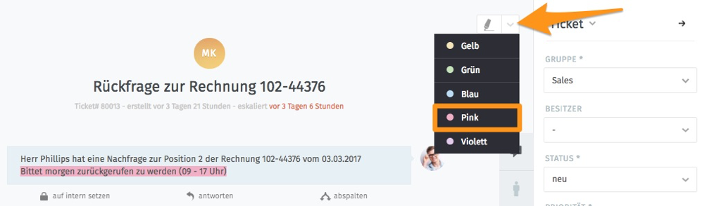

Gut zu wissen
*************

Textteile markieren
===================

Innerhalb eines Tickets besteht die Möglichkeit, beliebig Textteile mit mehreren Farben zu markieren.

Mehrere Textteile können wie folgt gleichzeitig markiert werden:

1. Ersten Textteil markieren
2. Klick auf Stift-Symbol
3. Alle weiteren Textteile markieren
4. Farbe auswählen

Um eine Markierung zu löschen, muss die farbige Stelle mit dem Mauszeiger ausgewählt werden. Durch nochmaligen Klick auf die Farbe, mit der markiert wurde, wird die farbliche Hinterlegung entfernt.

Artikel-Informationen ansehen
=============================

Durch einen Klick auf die jeweiligen Artikel können Informationen zum Typ, Absender und ggf. Empfänger angezeigt werden. Beispiel:

.. image:: images/gettingstarted/Abb41-ArtikelInformationen.png

Über dem Ticket-Artikel erscheint der Ersteller und bei einer E-Mail der Empfänger und ggf. alle in CC stehenden Empfänger. Unterhalb des Artikels wird der jeweilige Kanal angezeigt.
