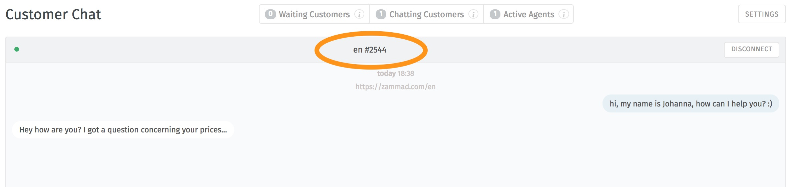
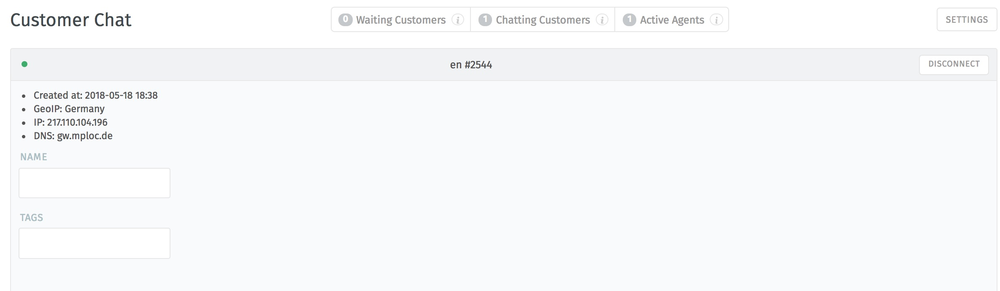

customer-Chat
===========

.. image:: images/gettingstarted/Zammad_Helpdesk_-_Customer_Chat.jpg

The chat function allows customers to contact registered agents directly. Not every agent has access to the chat function, though.

**In the chat overview you will find the following areas:**

1. On/Off switch: If the chat is activated for at least one agent, the chat is made available to the customer. The agents with activated chat are informed as soon as a customer starts the chat (by clicking on the chat window on the website). If the chat is switched off, the respective agent does not receive any messages about started chats.
2. The customers whose chat has not yet been accepted by an agent are displayed here. This field flashes blue as soon as a customer is in the "queue". As soon as you click on this field, the chat window of the waiting customer is opened and the chat can start.
3. shows customers who have already been included in chats.
4. shows agents who have activated the chat.
5. The maximum number of concurrent chat windows and automatic replies can be set in the settings.
6. number of agents or customers in the respective selection.
7. further information about the customers or agents in the respective selection.

In the chat, text modules can be used to quickly answer standard questions. A list of all text modules can be displayed by entering"::" (= two colons). Use the arrow keys to scroll through the text modules. They are inserted with "Enter". The search can be restricted by entering keywords.

Copy & Paste can also be used to send and receive documents and images in the chat.

By clicking on the chat shortcut at the top in the middle you get to the detailed view of the chat:

By clicking on the chat shortcut you get to a mask in which you can enter the name of the chat partner as well as tags:

Converting Chat to a Ticket
----------

There is the case that a chat has to be edited later. You can convert a completed chat into a ticket by clicking on it:

.. image:: images/gettingstarted/Abb55User-Chat_1.jpg

After clicking on the button "turn chat into ticket" you will get to the ticket creation screen with a link to the chat window:

.. image:: images/gettingstarted/Zammad-New-Ticket_Chat.jpg

The ticket can now be processed as usual with all standard ticket functions. The chat is stored on the ticket and can be viewed by agents at any time.

Chat-Archive
----------

You can find and reopen closed chats via the global Zammad search. This allows you to search for information afterwards and, if necessary, create a ticket from a chat:

.. image:: images/gettingstarted/Abb56User-Chat_2.jpg
