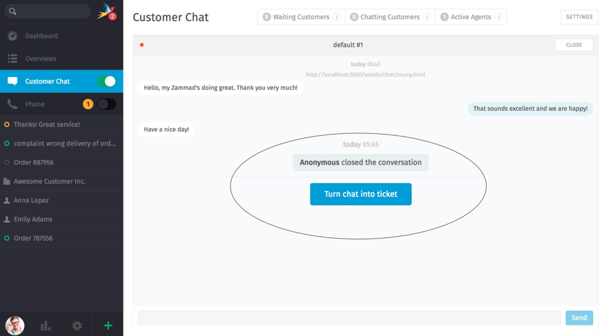
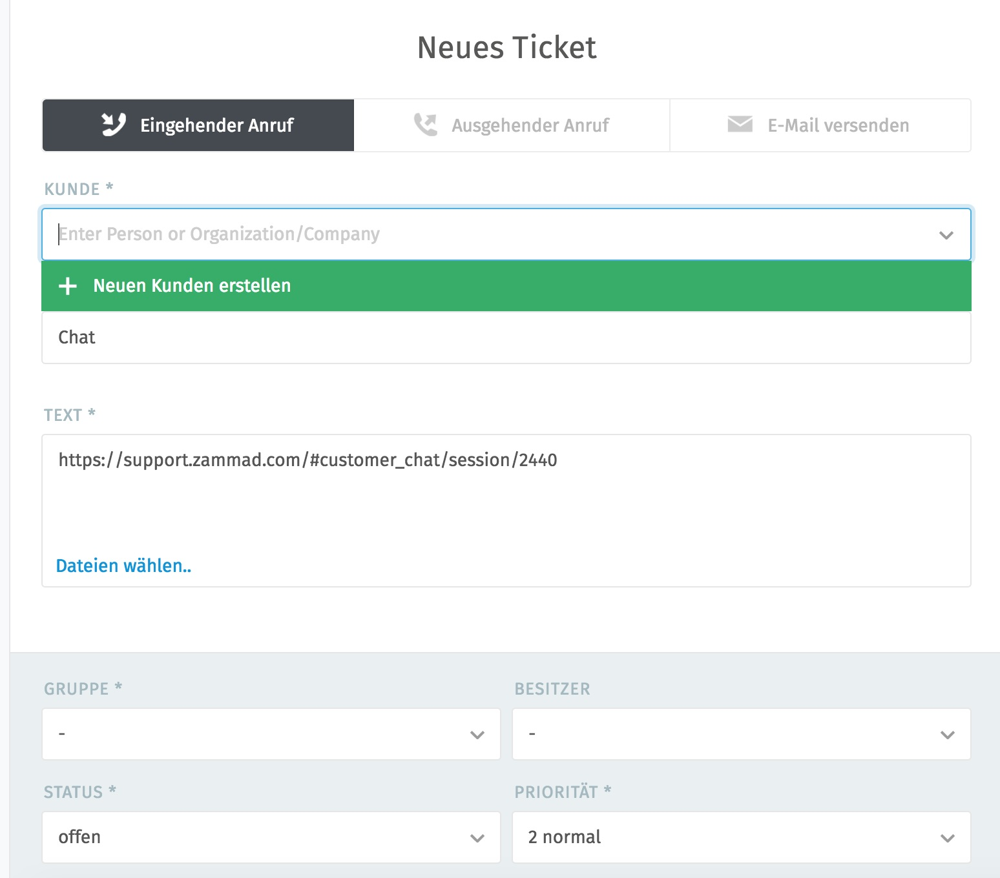
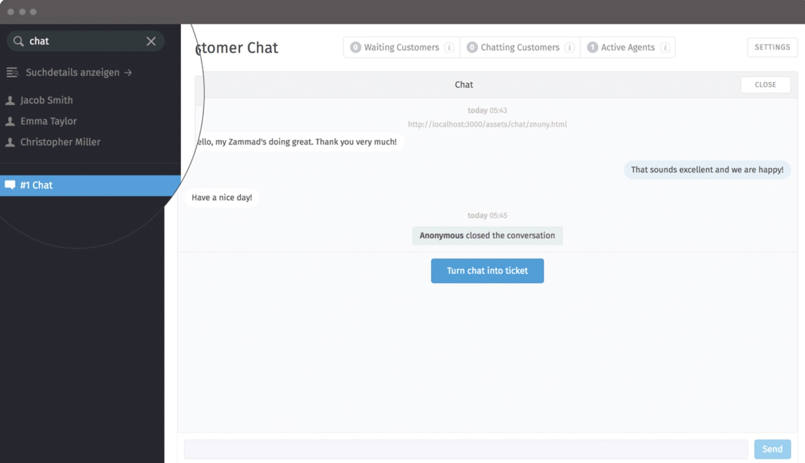

Kunden-Chat
===========

.. image:: images/gettingstarted/Abb3-Kunden-Chat.jpg

Durch die Chat-Funktion können Kunden mit angemeldeten Agenten direkt in Kontakt treten. (Nicht jedem Agenten steht die Chat-Funktion zur Verfügung.)

**In der Chat-Übersicht gibt es folgende Bereiche:**

1. An-/Aus-Schalter: Ist der Chat bei mindestens einem Agenten eingeschaltet, wird dies den Kunden angezeigt. Die Agenten mit aktiviertem Chat werden informiert, sobald ein Kunde den Chat startet. Ist der Chat ausgeschaltet, bekommt der jeweilige Agent keine Meldungen über gestartete Chats.
2. Hier werden die Kunden angezeigt, deren Chat noch kein Agent angenommen hat. Dieses Feld blinkt blau, sobald sich ein Kunde in der „Warteschlange“ befindet. Sobald man auf dieses Feld klickt, wird das Chatfenster des wartenden Kunden geöffnet und der Chat kann starten.
3. Zeigt Kunden, die bereits in Chats aufgenommen wurden
4. Zeigt Agenten, die den Chat aktiviert haben
5. In den Einstellungen können die maximale Anzahl an gleichzeitigen Chatfenstern und automatische Antworten festgelegt werden.
6. Anzahl der Agenten bzw. Kunden
7. Informationen zu den Kunden bzw. Agenten

Im Chat können Textbausteine zur schnellen Beantwortung von Standardfragen angewendet werden. Eine Liste aller Textbausteine kann mit der Eingabe "::" (zwei Doppelpunkte) angezeigt werden. Mit den Pfeiltasten können die Textbausteine durchgeblättert werden. Eingefügt werden sie mit "Enter". Durch die Eingabe von Stichwörtern kann die Suche eingeschränkt werden.

Durch Copy & Paste können Dokumente und Bilder im Chat gesendet und empfangen werden.

Chat in ein Ticket überführen
----------

Es gibt häufig den Fall, dass ein Chat nachträglich weiter bearbeitet werden muss. Dazu kann man per Klick einen abgeschlossenen Chat in ein Ticket überführen:

Nach dem Klick auf den Button gelangt man wie gewohnt in die Ticket-Erstellmaske mit einem Link zum Chatfenster:

Das Ticket kann wie gewohnt in der Organisation mit allen vorhanden Ticket-Funktionen weiter bearbeitet werden. Der Chat ist am Ticket hinterlegt und kann jederzeit von Agenten eingesehen werden.

Chat-Archiv
----------

Sie können geschlossene Chats über die globale Zammad-Suche finden und wiedereröffnen. Somit können Sie auch im Nachhinein über Informationen recherchieren und ggf. aus einem Chat ein Ticket erstellen:

