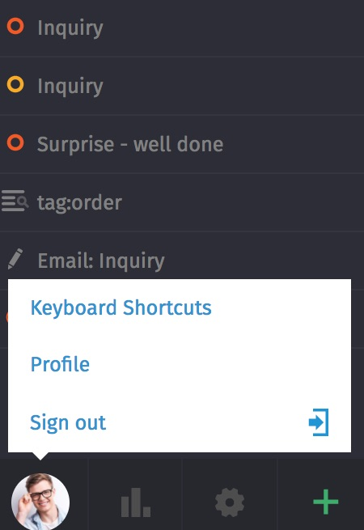
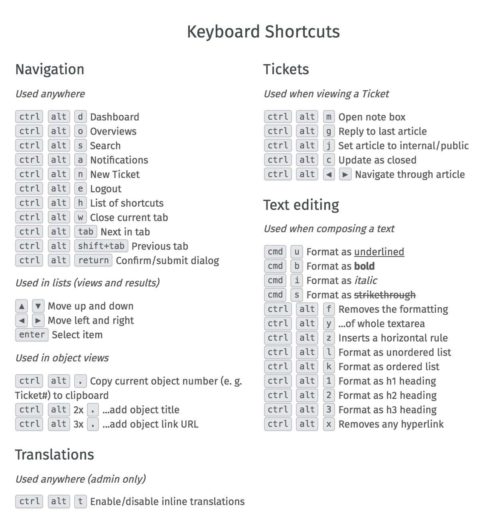

Menubar
===========================

A click on the avatar (picture below left) leads to the personal agent menu:

Here you will find information about keyboard shortcuts, profile settings and logging off.

Keyboard Shortcuts
----------

By clicking on the avatar (picture below left) you can see the keyboard shortcuts. Alternatively, these can be viewed using the following key combination:
Ctrl + H or for Mac users Cmd + Ctrl + Alt + H

The following functions can be implemented using keyboard shortcuts: Text formatting, translations and navigation within the ticket system and ticket actions:

For text formatting, the text to be formatted must be selected before the corresponding combination is pressed.

Profile Settings
----------

The following personal settings can be defined here:

:Language: Here you can set the language in which the system is to be used. This setting only affects the "system's own words", but not ticket content.

:Avatar: Here you can select your own avatar image.

:Password: If this option is enabled by the admin, you can change your own login password here.

:Notifications: Here you can set for which ticket events you will be notified in which way.

.. image:: images/gettingstarted/Zammad_Helpdesk_-_Notifications1.jpg

The settings on the left refer to Zammad's own notifications by the Zammad Phoenix:

.. image:: images/gettingstarted/Phoenix.jpg

By checking the box on the right side, you will receive additional (!) e-mail notifications about the activity in Zammad (The content of this system message cannot be configured via the interface).

A restriction to ticket-notofications within certain groups can be made. If you do not want to be informed about tickets of a group, the check mark can be removed accordingly.

In addition, the sound can be defined for an incoming notification.

:Out of Office: A replacement can be entered for the time you cannot process tickets. The deputy receives notifications about changes of the tickets assigned to you within the defined time. In addition, all tickets you own are listed in a separate overview for that person.

:Calendar: To display your own tickets in your own calendar app, the corresponding link can be viewed here.

:Devices: All computers and browsers that have/have access to your Zammad are displayed here.

:Token Access: Generate a personal access token for each application that should access the Zammad API.

:Linked Accounts: Accounts linked to Zammad (Facebook, Twitter,...) can be displayed here.

Sign out
----------

By clicking on the Logout button you are immediately logged out and you will be redirected to the login/start screen.
