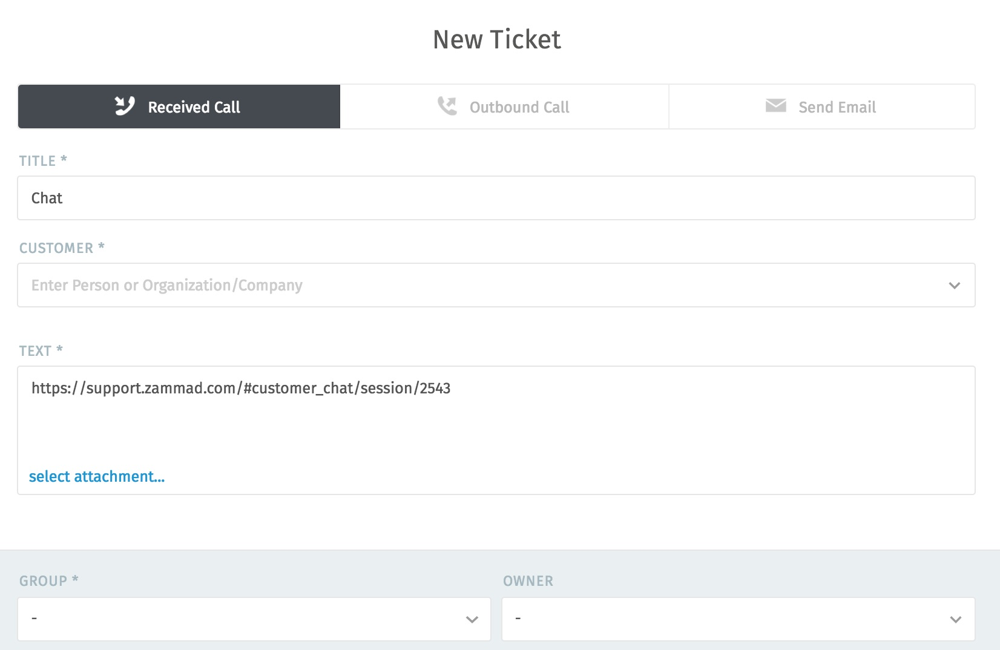

Customer Chat
=============

Talk to customers in real time from the **customer chat** panel.

.. note:: **🤔 Huh? I don’t see “Customer Chat” in the menu...** 

   This feature is **optional**; if you don’t see it in the main menu, that
   means it’s not enabled yet. See the `admin documentation`_ for details.

.. figure:: images/main-menu/customer-chat.jpg
   :alt: Sample view of Customer Chat

   Enable the chat panel to be notified when customers are waiting to chat.

   +---------------------------------------------------------------------------+
   | Chat controls                                                             |
   +===========================+===============================================+
   | **1. On/Off**             | Enable/disable the chat panel.                |
   +---------------------------+-----------------------------------------------+
   | **2. Waiting Customers**  | Lists customers awaiting an agent for chat.   |
   |                           | **Click to answer a pending chat request.**   |
   +---------------------------+-----------------------------------------------+
   | **3. Chatting Customers** | Lists customers currently in an ongoing chat  |
   |                           | session.                                      |
   +---------------------------+-----------------------------------------------+
   | **4. Active Agents**      | Lists all agents with chat enabled.           |
   +---------------------------+-----------------------------------------------+
   | **5. Settings**           | Click for chat configuration options (*e.g.,* |
   |                           | auto-greetings and maximum number of          |
   |                           | simultaneous chats).                          |
   +---------------------------+-----------------------------------------------+
   | **6. Count badge**        | Displays the number of users in each section. |
   +---------------------------+-----------------------------------------------+
   | **7. Info card**          | Hover over for detailed information about the |
   |                           | users in each section.                        |
   +---------------------------+-----------------------------------------------+

.. warning:: If all agents have the chat panel disabled, customers will **not**
             be able to initiate a chat.

.. tip::

   * 🔍 Use the :doc:`search bar </main-menu-search>` to pull up old chats from the archive anytime.
   * 📋 Copy & paste **supports 🌄 images and 📄 documents** as well as plain text.
   * ⌨️ Live chat supports `text modules`_.
   * 📝 Chats can be **renamed** or **tagged**, and record technical details about
     the customer’s connection.
     
     .. figure:: images/main-menu/customer-chat-details.png
        :alt: Chat details view
        :align: center
        :scale: 30%

        Click on the title at the top of the chat window to edit chat details.

Creating a Ticket from a Chat
-----------------------------

Once your chat is over, you can create a ticket for it with a single click:

.. figure:: images/main-menu/customer-chat-create-ticket.jpg
   :alt: Completed chat window
   :align: center

   The **Turn chat into ticket** button appears as soon as the chat is finished.

   A link to the chat is automatically included in the first note on the ticket.

.. _admin documentation: https://zammad-admin-documentation.readthedocs.io/en/latest/channels-chat.html
.. _text modules: https://zammad-admin-documentation.readthedocs.io/en/latest/manage-text-modules.html
