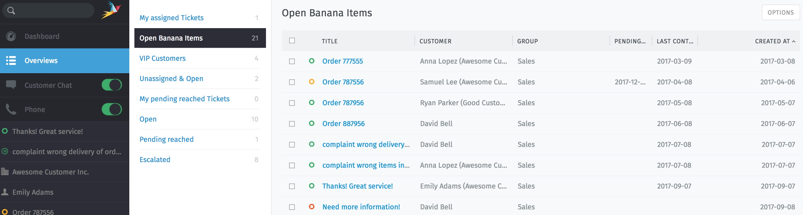

Overviews
=========

Find tickets that need attention fast in the **overviews** menu.

   Overviews are filtered lists of tickets.

   +---------------------------------------------------------------------------+
   | Built-in filters                                                          |
   +================================+==========================================+
   | **My assigned tickets**        | All tickets owned by the current user.   |
   +--------------------------------+------------------------------------------+
   | **Unassigned & Open**          | All open tickets without an owner.       |
   +--------------------------------+------------------------------------------+
   | **My pending reached tickets** | All open tickets owned by the current    |
   |                                | user, previously marked “pending”, and   |
   |                                | currently due.                           |
   +--------------------------------+------------------------------------------+
   | **Open**                       | All open tickets owned by **any** agent. |
   +--------------------------------+------------------------------------------+
   | **Pending reached**            | All open tickets owned by **any** agent, |
   |                                | previously marked “pending”, and         |
   |                                | currently due.                           |
   +--------------------------------+------------------------------------------+
   | **Escalated**                  | All escalated tickets owned by **any**   |
   |                                | agent.                                   |
   +--------------------------------+------------------------------------------+

Admin users may create additional, custom overviews. Consult the `admin documentation`_ for more details.

.. tip:: **🖱️ UI Protip**

   * Click on column headings to change the display order.
   * Click-and-drag column dividers to adjust their width.

.. _admin documentation: https://zammad-admin-documentation.readthedocs.io/en/latest/manage-overviews.html
