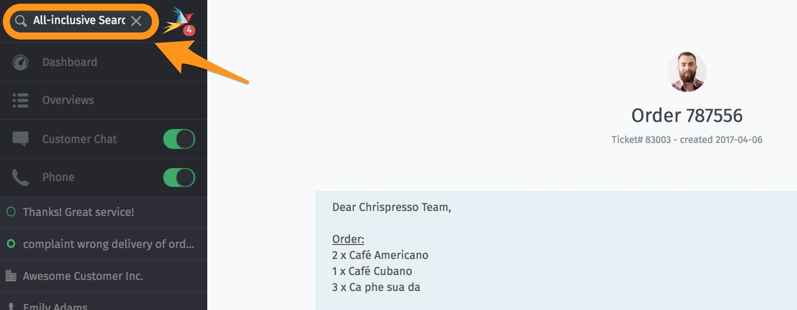
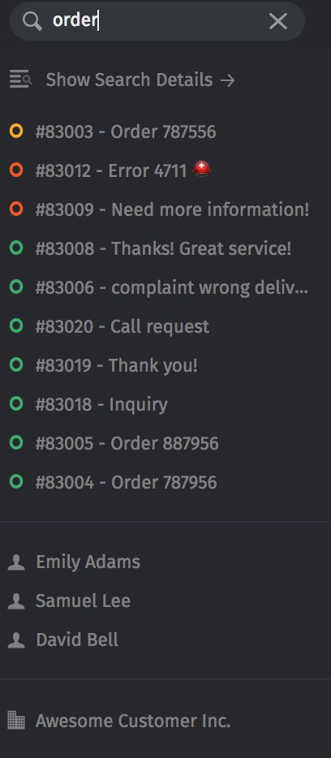

Search
======

Use Zammad’s powerful omnisearch to pull up tickets, users, organizations, and chat logs in a snap.

   The search bar is located in the upper-lefthand corner.

   Results appear immediately under the search bar as you type.

.. figure:: images/main-menu/search-details.jpg
   :align: center

   For detailed results, click the **Show Search Details →** link just above the autocomplete list.

.. hint:: **🔍 Here are just a few of the places the search engine will look:**

   * 💬 message subject/content
   * 👩 recipient names & email addresses
   * 📎 text in file attachments (really!)
   * 📝 user/organization metadata (*e.g.,* notes stored on customer profiles)

.. tip:: **🖱️ UI Protip**

   * The *Search Details* page sorts results into four groups: **tickets**, **chat logs**, **users**, and **organizations**.
   * In *Search Details*, click on column headings to change the display order.
