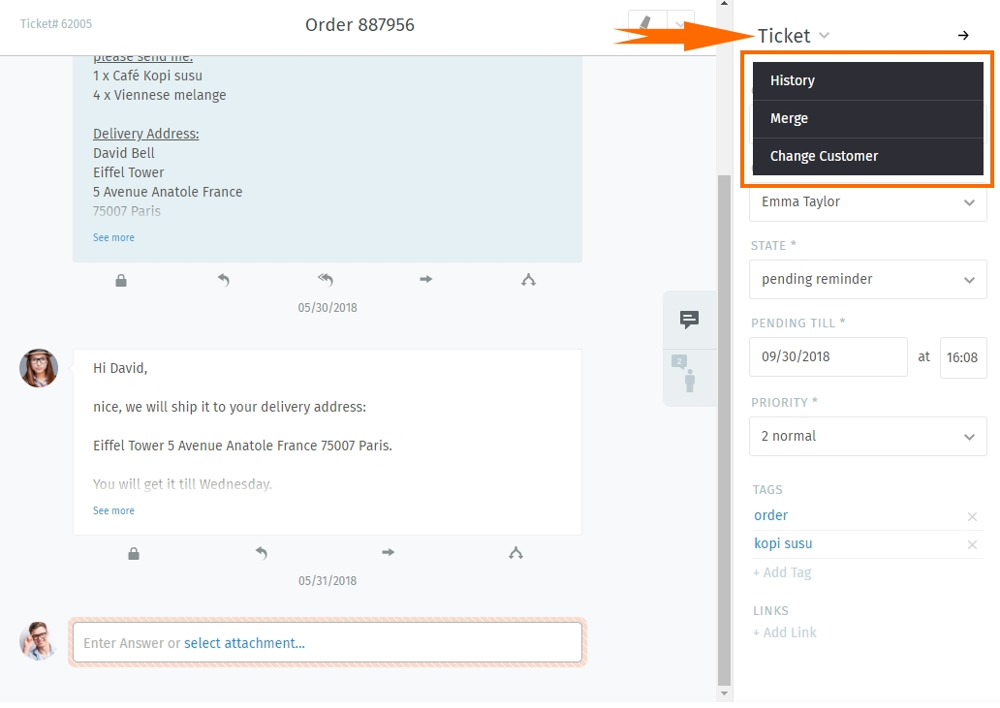

Ticket information
==================

Within every ticket you can add and update information for tickets, customers and their organisations.

After clicking on the message-icon on the right site, you'll get details about the ticket.

.. image:: images/ticket/ticket-information-1.jpg

If you have the necessary rights, you can change the group, owner, state and priority of the ticket. But what are those information about?

Group
-----
Tickets can get into Zammad via different Channels and can be sorted into different groups each by different criteria.
Within Zammad, you can see groups like working groups or departments within a company that can work on different topics.

**As example:** All Tickets for the Sales-Team can be found within the group "Sales", while the Support-Devision (e.g. for your IT) can find their tickets within the group "Support".
By dividing your departments, your agents only can see what they need and won't get distracted by other tickets.
This can also come in handy in case you have departments like legal or accounting that work on information the Sales-Team or Support-Team are not supposed to see.

You can compare a group to a big cupboard where you sort all your records (Tickets) you need to work on.
Every Agent of the Team (Group) has access to this cupboard and can work on your cases (Tickets).

You can use Roles within Zammad to ensure that your agents can only see groups contents that they are responsible for. 
An agent can have different rights on groups: You can determine if the agents shall only have read-, move- or creation-rights on a group.

Owner
-----
Let's stick with the metaphor from before: We have a file (Ticket) in our cupboard that I'm responsible for - I want to work on that file.
In this case I'll take the care and I'll work on it. My colleagues can't work on this case.
With Zammad, you can assign yourself as an owner of the ticket and you'll get a similar result. 
*(Side note: Zammad doesn't show the Ticket as "unassigned" - other agents can always take a look into the case and add notes or answers if they have the needed rights to do so)*

Let's say you notice that you can't process the ticket further, because your colleague is responsible for this. You can then change the owner to them and the ticket shows up in his overview.
This is similar to handing him over your file / putting it onto his desk.
He'll find the ticket within the overview "my assigned Tickets" and also get notified about this action. (please see noification settings within profile)

State
-----
You can learn more about states within Zammad here_.

.. _here: https://zammad-user-documentation.readthedocs.io/de/latest/zammad-ticket-states.html

Priority
--------
You can use priorities to realize e.g. reaction times or have special overviews only showing the really important stuff you have to solve before anything else.
You can define Service Level Agreements (SLAs) to filter for ticket priorities  and escalate the ticket if the initial answer took too long or to ensure the solving time is respected.
This can help you to consider the service contracts of your customers correctly.

The Admin can create triggers and/or automations that can do several things, if a ticket reaches a certain priority. 
For example, those actions can be an automated message (customer, agent), the change of a group/owner, setting states and much more...! 
Here you can find more about Triggers_ and Automations_.

.. _Triggers: https://zammad-admin-documentation.readthedocs.io/de/latest/manage-trigger.html
.. _Automations: https://zammad-admin-documentation.readthedocs.io/de/latest/manage-scheduler.html

Tags and Links
--------------
Here you can find further information about tags_ and links_.

.. _tags: http://zammad-user-documentation.readthedocs.io/de/latest/zammad-ticket-tags.html
.. _links: http://zammad-user-documentation.readthedocs.io/de/latest/working-ticket-links.html

further ticket actions
----------------------

After clicking on "Ticket" you'll get further actions you can do inside the ticket:

* Display History_ (who has done what (and when!) on the ticket)
* Merge_ tickets (in case you have two Tickets from a customer that belong together, simply merge them into one!)
* Change_ customer (e.g. when your customer changed his E-Mail-Address or Zammad might have chosen the wrong customer)

.. _History: https://zammad-user-documentation.readthedocs.io/en/latest/ticket-submenu.html
.. _Merge: https://zammad-user-documentation.readthedocs.io/en/latest/ticket-submenu.html#merge
.. _Change: https://zammad-user-documentation.readthedocs.io/en/latest/ticket-submenu.html#change-customer

We'll get further into detail on the next pages.