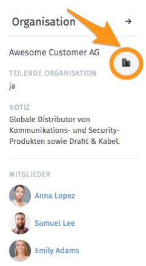

Informationen zu Organisationen
===============================

.. image:: images/gettingstarted/Abb27-OrganisationBearbeiten.png

Ein Klick auf das Gruppen-Icon führt zu den Informationen über die Organisation, der das Ticket zugeordnet ist. Diese Informationen können dann über einen weiteren Klick auf "Organisation" bearbeitet werden.

Weitere Detailinformationen zur Organisation sind über das Icon rechts neben dem Namen der Organisation erreichbar:

Diese Detailansicht enthält Informationen über offene und geschlossene Tickets aller Mitglieder der Organisation (sofern es eine teilende Organisation ist). Zusätzlich werden offene und geschlossene Tickets angezeigt.

.. image:: images/gettingstarted/Abb29-Uebersicht-Organisation.png
