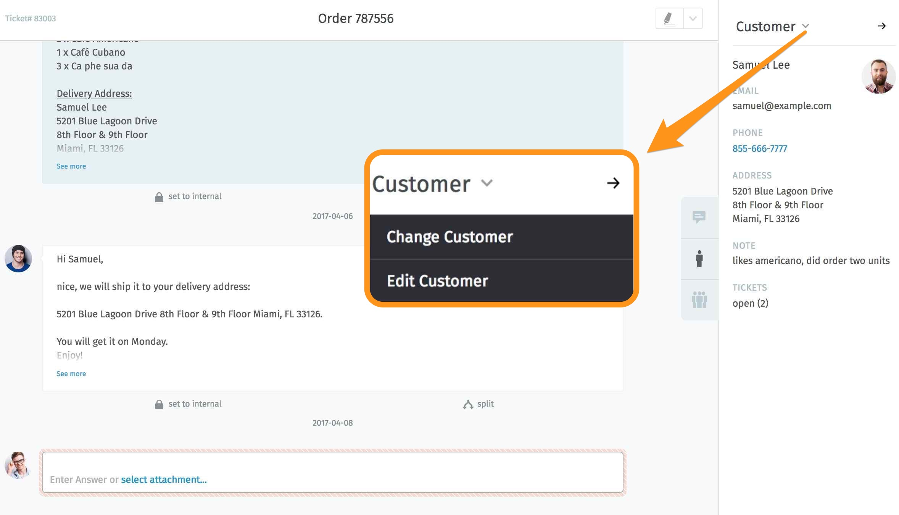

Customer View
=============

.. image:: images/ticket-pane/customer-view.jpg

By clicking on the “person” icon on the right side, information about the ticket’s customer will be displayed. These can be changed system-wide:

After clicking “Customer” and then “Edit customer”, a dialog to edit customer data opens up:

.. image:: images/ticket-pane/customer-view-edit.jpg

The following data can be changed within this dialog:

* Contact information
* Assign to an / another organization
* Change password
* Assign a VIP status (*)
* Activate/deactivate

(*) Hint for setting the VIP-State for customer:
Defining VIP-status has several advantages for using Zammad. For example, overviews of tickets of VIP customers can be used, certain VIP SLA's defined or VIP triggers can be generated.
