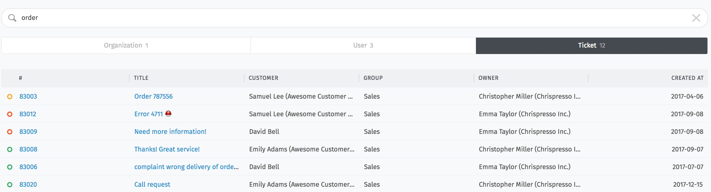

Search
======

In Zammad you can search for everything that has ever been stored in Zammad - message content, -subject, -recipients, information stored in customer- and organization-details and even content in attachments.
The input field for the all-inclusive search is (always) located at the top left:

.. image:: images/gettingstarted/search-location.jpg

The search starts by entering a search term.
The results are listed in short form below the input field in the order that tickets which contain the search term in some form are listed above, followed by customers and organizations at the very bottom.

.. image:: images/gettingstarted/search-order.jpg

The complete search result can be accessed via "Show search details" (between the input field and the results):

In the search detail view, the search results can be filtered by organization, user and ticket hits.
The individual ticket columns can be sorted by clicking on the column name.
