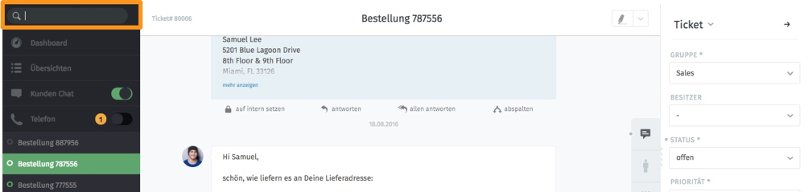
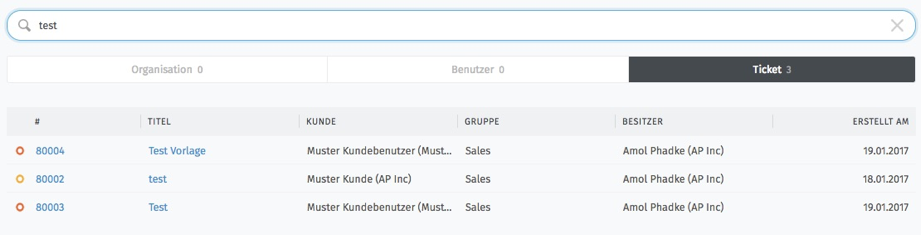

**Suche

Die Suchmaske befindet sich (egal in welchem Fenster man sich befindet) im Fenster links oben:

Es kann nach allen Ticketinhalten gesucht werden. Die Suche beinhaltet Texte innerhalb der Artikel, Kundennamen, Organisationen, Ticketnummern aber auch Namen der Anhänge von Artikeln.
Bei der Eingabe des Suchbegriffes werden darunter automatisch einige Tickets, Kunden, Organisationen und Projekte, die den Begriff beinhalten aufgelistet, wie in der Abbildung zu sehen:

.. image:: images/Abb38-dynamischeSuche.png

Eine vollständige Auflistung der Suche erhält man, indem man auf „Suchdetails anzeigen“ klickt. Man gelangt auf folgende Übersicht:

In der Suchdetail-Ansicht können die Suchergebnisse nach Organisations-, Benutzer- und Ticket-Treffern gefiltert werden.
Die einzelnen Ticket-Spalten können durch einen Klick auf den Spaltennamen sortiert angezeigt werden.
