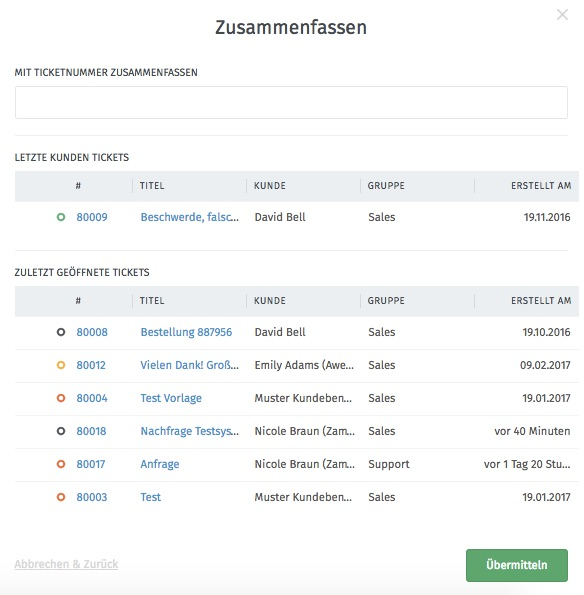

Historie
========

Zeigt alle Änderungen, die am Ticket vorgenommen wurden - auch die anderer Benutzer.

Zusammenfassen
==============

Diese Funktion wird verwendet, um mehrere Tickets zu einem zusammenzufassen.
Im Eingabefeld wird das Ziel-Ticket eingegeben, mit dem das aktuelle Ticket zusammengeführt werden soll. Im unteren Teil des Dialogs werden Vorschläge zu verwandten Tickets angezeigt.
Das aktuell ausgewählte Ticket existiert nach der Zusammenfassung nicht mehr als eigenständiges Ticket.

Kunde ändern
============
.. image:: images/gettingstarted/Abb23-Kunden_aendern.jpg

Hiermit kann der Kunde geändert werden, der für das Ticket hinterlegt wurde. Dabei können nur Personen oder Organisationen eingetragen werden, die in Zammad bereits angelegt wurden. Bei der Eingabe der Organisation werden dieser zugewiesene Mitarbeiter vorgeschlagen und können somit ausgewählt werden.
