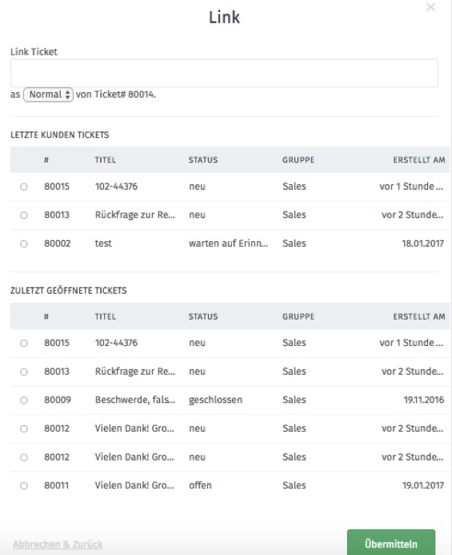

Tickets verlinken
==================

Tickets können untereinander verlinkt werden.

.. image:: images/gettingstarted/Abb35-TicketsVerlinken.png

Der Dialog zur Verlinkung zwischen zwei Tickets öffnet sich nach einem Klick auf "Link hinzufügen" unter den Ticket-Informationen.

In diesem Dialog werden Tickets für eine Verlinkung vorgeschlagen. Dabei kann zwischen zuletzt geöffneten Tickets oder den letzten Tickets des Kunden gewählt werden. Es kann auch eine Ticketnummer in das obere Textfeld eingetragen werden.
Des Weiteren wird noch die Art der Verlinkung ausgewählt: Eltern, Kind oder "normal".

