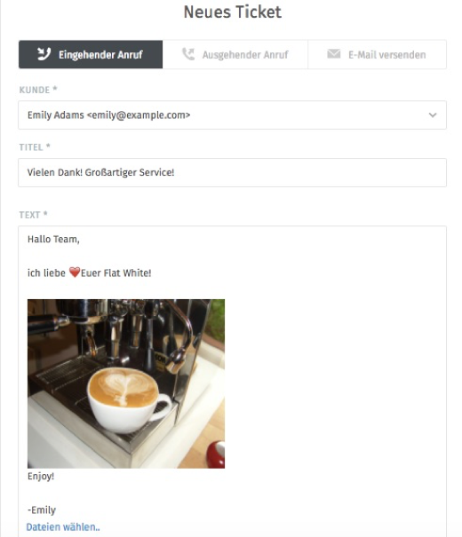

Variante 2 - Ticket abspalten
=============================

Müssen Teile eines Tickets von mehreren Personen/Abteilungen bearbeitet werden, ist die Teilung des Tickets sinnvoll. Speziell für Prozesse, die unterschiedliche Laufzeiten haben, bietet sich dies an.
Unterhalb des Artikels muss dafür auf „abspalten“ geklickt werden:

.. image:: images/gettingstarted/Abb32-ArtikelAbspalten.png

Dies führt zum "normalen" Ticket-Erstellungsdialog. Dieser enthält dann jedoch bereits alle Informationen, die am Ticket gespeichert waren, also auch den Inhalt des jeweiligen Artikels.

Es kann nun ausgewählt werden, ob das neue Ticket als eingehender/ausgehender Anruf oder als E-Mail erstellt werden soll. Die Informationen des Kunden können ebenfalls angepasst werden bevor das neue Ticket erstellt wird.

Das abgespaltene Ticket enthält die Information, von welchem Ticket es abgespalten wurde (Eltern-Ticket). Informationen über Eltern- und Kind-Verlinkung können unter den Ticket-Informationen eingesehen werden. Die Verlinkungen können durch Klick auf das Kreuz rechts neben der Verlinkung entfernt werden.

.. image:: images/gettingstarted/Abb34-Parent-Child-Verknuepfung.jpg
