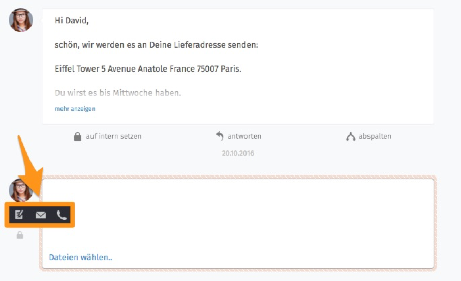

**Arbeiten mit Tickets

Möchte man ein Ticket bearbeiten, hat man die Möglichkeit in der Ticketmaske folgende Artikel zu erstellen:
•	Notiz (intern / extern)
•	E-Mail (intern / extern)
•	Telefon-Anruf (intern / extern)
Um auszuwählen, welche Art von Artikel man erstellen möchte, klickt man zuerst in das leere Feld unterhalb des letzten Artikels. Bereits jetzt kann man anfangen zu schreiben oder Dateien einzufügen. Alle Inhalte bleiben gespeichert. Dabei ist es egal, ob man zwischen Tickets wechselt, das Fenster schließt oder die Artikel-Art auswählt. Diese Auswahl erhält man durch einen Klick auf den Notizblock links neben dem Textfeld, wie im folgenden Bild dargestellt:

Nun können Artikel, wie bereits in bisherigen Kapiteln beschrieben, erstellt werden.

Man kann selbst erstellte Artikel aus dem Zammad löschen.
Diese Funktion ist jedoch mit Vorsicht zu genießen.

Für das Zusammenarbeiten der Mitarbeiter im Zammad werden zwei Varianten als sinnvoll betrachtet.

Variante 1 beschreibt das „Weiterreichen“ von Tickets von Gruppe zu Gruppe und ist damit für lineare Abläufe sowie einen ersten Start in der Nutzung von Zammad gut geeignet.
Dafür wird das Ticket entweder nur der Gruppe zugewiesen oder direkt einem zuständigen Mitarbeiter innerhalb einer Gruppe, der das Ticket bearbeiten soll.

Variante 2 beschreibt das Arbeiten durch die Verwendung der „Ticket abspalten“-Funktion. Hierbei wird ein Artikel eines bestehenden Tickets als eigenständiges Tickets abgespalten und kann asynchron bearbeitet werden.