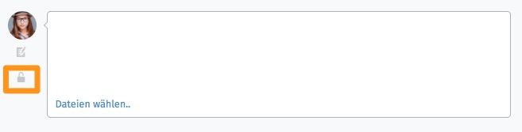

Ticketdialog
============

Ein Klick auf ein Ticket in einer Ticketliste (z. B. über das Dashboard-Widget "Neue Tickets") führt zum Ticketdialog:

.. image:: images/gettingstarted/Abb12-Ticketmaske-Uebersicht.jpg

Dieser bietet folgende Aktionen zur Ticketbearbeitung an:

Antwort-E-Mail versenden
========================

.. image:: images/gettingstarted/Abb13-Antwort-Email_versenden.jpg

Unter einer E-Mail befinden sich die Buttons "antworten" und bei mehreren Empfängern "allen antworten". "antworten" führt automatisch zum Antwort-Email-Dialog, in dem der Absender des Artikels als Empfänger vorausgefüllt wird. Wurde der Artikel an mehrere Personen gesendet, können durch Klick auf "allen antworten" alle Empfänger aus dem CC übernommen werden.
Auch hier können Anhänge hinzugefügt werden.

Notiz anlegen
=============

.. image:: images/gettingstarted/Abb14-Notiz_erstellen.jpg

Ein Klick auf das orange umrandete Eingabefeld unter dem letzen Artikel des Tickets erstellt eine interne Notiz.

Weiterleiten eines Artikels
===========================

.. image:: images/gettingstarted/Abb15-Weiterleiten_eines_Artikels.jpg

Durch einen Klick auf "abspalten" unter einem Artikel kann eine Notiz, Anrufer-Info oder E-Mail weitergeleitet werden. Es wird automatisch ein neues Ticket mit den vorgegebenen Ticket-Infos erstellt.

Vermerken eingehender und ausgehender Anrufe
============================================

Soll ein Anruf in Zammad eingestellt werden, wird zunächst ein neues Ticket erstellt und der entsprechende Artikeltyp gewählt.
Bei bestehenden Tickets, wird links neben dem Eingabefeld für einen neuen Artikel der Typ "Anruf" (Telefonhörer) ausgewählt:

.. image:: images/gettingstarted/Abb16-Anruf_vermerken.jpg

Nun können die Informationen des geführten Gespräches eingetragen werden. Der Kunde kann diese Information nur sehen, wenn der Artikel als öffentlich markiert wurde und er Zugriff auf das System hat. Andernfalls nützt diese Funktion nur dem internen Wissenstransfer.

Artikel intern oder öffentlich setzen
=====================================

Über einen Klick auf das Schloss-Icon kann ein Artikel als intern oder extern markiert werden. Interne Einträge sind für den Kunden nicht sichtbar.
Interne Artikel werden durch einen orangen Rand hervorgehoben.

.. image:: images/gettingstarted/Abb18-int-ext_Artikel.png

Ticket-Betreff ändern
=====================

.. image:: images/gettingstarted/Abb19-Betreff_aendern.jpg

Ein Klick in den Betreff eines Tickets ermöglicht die direkte Änderung des Betreffs.
