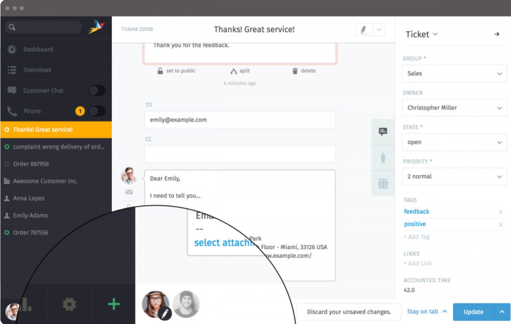
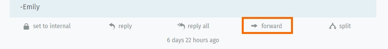
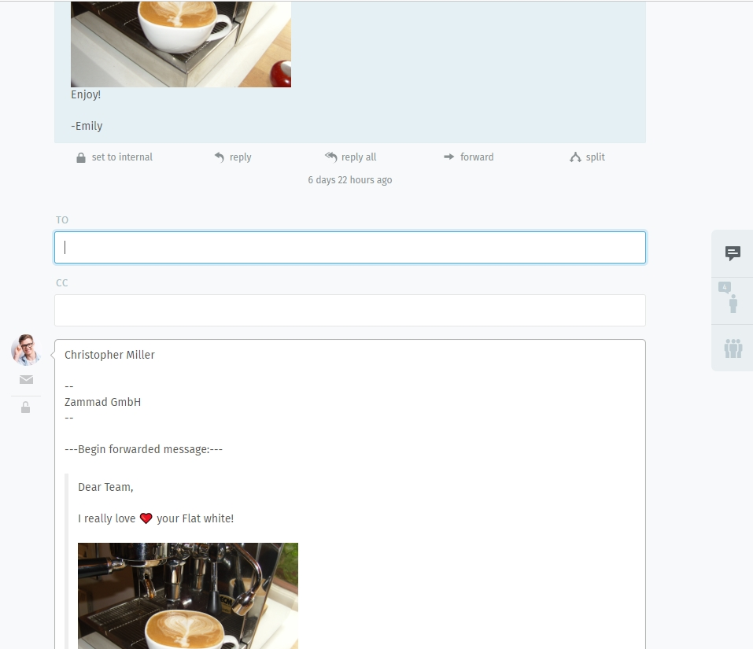
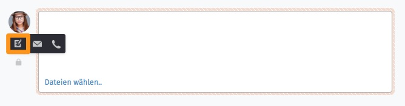
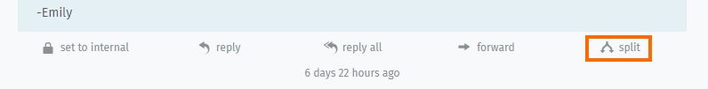

Ticket Dialog
=============

Clicking on a ticket within the ticket list (e.g. using the overview "New Tickets") will lead to the ticket dialog:

.. image:: images/ticket/ticket-overview.jpg

In order to prevent two agents from working on a ticket at the same time, Zammad has a collision detection.
With this function, the agents can see who's actually taking a look on the ticket and also who is editing the ticket.
Zammad will display the edit (as pen) as soon as you change **anything** to the ticket (group, text - doesn't matter).

The ticket dialog offers the following options for the ticket:

Reply to an E-Mail
==================

.. image:: images/ticket/ticket-reply-to-email.jpg

Below E-Mail-Articles you'll find the button "reply". If the article has several recipients, Zammad will also display "reply all". 
Both buttons will automatically open the E-Mail-Dialog (prefilled to (and CC if recipients were in the article) and subject).
You can add attachments and inline images to your answer.

Forwarding
==========

You can forward a complete E-Mail (including attachments) or a customer to a third party (that doesn't have to use Zammad, e.g. a supplier).

This simply works without any down- or uploading of the attachments. By pressing "forward" below the article, the whole content (including attachments) will be quoted in a new E-Mail within the same ticket.

You can edit the E-Mail as you desire before sending the E-Mail.

Creating a Note
===============

With a click into the orange bordered text field, you can add a new internal note to the ticket.
**Note:** This is the default - you can change the note field to be a public note by default, if you want to.

Splitting an article
====================

By clicking on "split" below an article, you can forward a note, call-information or E-Mail.
Zammad will automatically create a new ticket with the provided information.

Take note of incoming and outgoing calls
========================================
