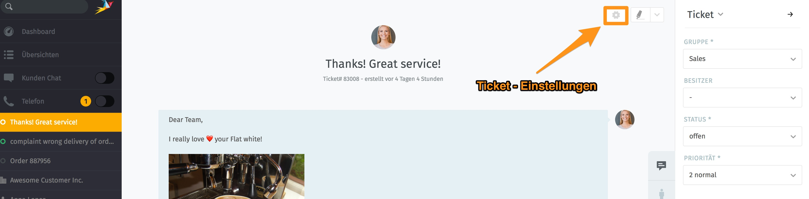
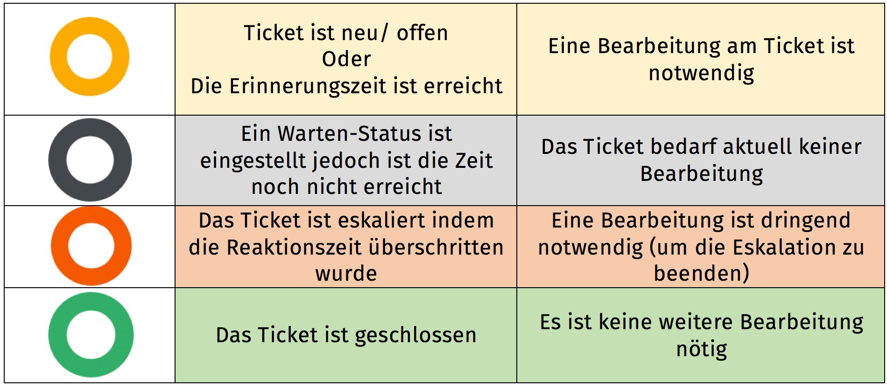

Ticket-Status
=============

Status zeigen den aktuellen Bearbeitungs-Stand der Tickets an. 

Folgende Status können den Tickets zugewiesen werden.

Eingestellt werden die Status direkt im Ticket, in den Ticket-Informationen. Mehr Infos dazu hier: 

http://zammad-user-documentation.readthedocs.io/de/latest/ticket-information.html 

Zur besseren Übersicht der Bearbeitungs-Stände werden im Zammad die Status mit Hilfe eines "Ampelsystems" angezeigt:

Diese Ampelzeichen werden in der linken Tab-Liste und in den Übersichen angezeigt.

**kleiner Hinweis**

Sieht man in der Ticket-Liste auf der linken Seite des Bildschirmes das Ampelzeichen pulsieren heißt das, dass eine neue Aktion am Ticket durchgeführt wurde. Dieses Pulsieren hört auf, sobald man in das Ticket hinein geklickt hat.