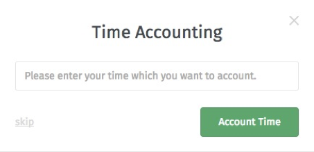

Zeiterfassung
=============

Man hat die Möglichkeit seine benötigte Bearbeitungszeit pro Ticket zu vermerken. Dafür erscheint automatisch beim Absenden eines neuen Artikels folgende Maske, in die man die entsprechende Zeit einträgt:

Ihre Admins haben die Möglichkeit in einer Übersicht sich die Bearbeitungszeit pro Kunde, Ticket und der Organisation anzusehen.